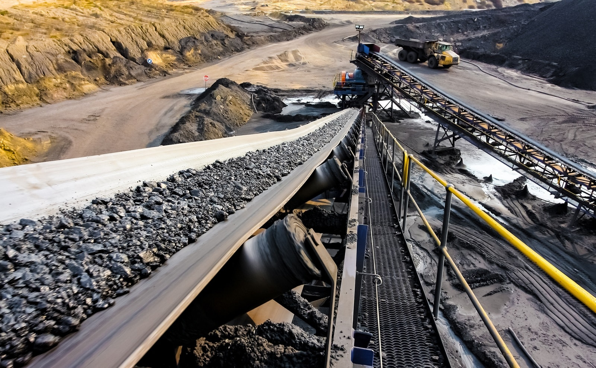

<div align="center">

 </div>


# Building High-Performance YOLO Datasets Course
<div align="center"></div>

## Lesson 1 : Start With the Business Objective
<div align="center"></div>
### Hands-On

#### Task

Write your project's four-line spec on a single page: business goal, vision task, class list, success metric. Share it with the stakeholder who's paying for the model. If they push back on any line, that's the line to fix before doing anything else.

### Solution

| Item | Description |
|------|-------------|
| **Business Goal** | Membuat sistem computer vision berbasis YOLO yang dapat mengklasifikasikan kualitas batuan nikel berdasarkan karakteristik visual yang sudah diberi label oleh geologist, sehingga proses sorting menjadi lebih cepat dan konsisten. |
| **Vision Task** | Image Classification. Karena tujuan model ini adalah menentukan kualitas dari satu batu pada setiap gambar berdasarkan kelas yang sudah ditentukan. |
| **Class List** | - High-grade Ore<br>- Medium-grade Ore<br>- Low-grade Ore<br>- Waste Rock<br>Kelas-kelas tersebut tidak saling tumpang tindih, sehingga satu batu hanya bisa masuk ke satu kategori. |
| **Success Metric** | Model diharapkan mampu mencapai Precision ≥ 95% dan Recall ≥ 90% pada holdout test dataset.<br>Target precision dibuat lebih tinggi agar kemungkinan batu berkualitas renda terklasifikasi sebagai ore dapat ditekan. Sementara itu, recall tetap dibuat tinggi agar batu yang memang berkualitas tidak banyak terlewat selama proses sorting. |


## Lesson 2 : Define the Dataset Specification
### Hands-On

#### Task

Draft the dataset spec for your project as a table: 5–10 scenario rows, with quotas. Show it to someone who knows the deployment site (a foreman, a shift lead, a customer). They'll add 2–3 scenarios you missed that's the value.

### Solution

#### Dataset Specification

| No. | Scenario | Main Variations | Quota | Target Images |
|:--:|-----------|-----------------|:-----:|--------------:|
| 1 | Batuan di conveyor saat cuaca cerah (siang) | Cuaca, pencahayaan | 20% | 1.000 |
| 2 | Batuan di conveyor pada pagi atau sore hari | Waktu, pencahayaan | 10% | 500 |
| 3 | Batuan di conveyor saat kondisi mendung atau hujan ringan | Cuaca | 15% | 750 |
| 4 | Batuan dengan berbagai ukuran (kecil, sedang, besar) | Ukuran objek | 15% | 750 |
| 5 | Batuan saling berhimpitan atau sebagian tertutup batu lain | Occlusion | 15% | 750 |
| 6 | Kamera sedikit berdebu atau terdapat noise ringan | Kondisi kamera | 13% | 650 |
| 7 | Background images (conveyor kosong tanpa objek target) | Background | 2% | 100 |
| 8 | Edge case: batu tertutup lumpur, basah, atau warna antar kelas hampir mirip | Edge Case | 10% | 500 |
| **Total** |  |  | **100%** | **5.000 gambar** |

#### Target Dataset

| Item | Description |
|------|-------------|
| Total Images | ± 5.000 gambar |
| Number of Classes | 4 kelas: High-grade Ore, Medium-grade Ore, Low-grade Ore, dan Waste Rock |
| Average Objects per Image | Diasumsikan sekitar 2–3 batu per gambar |
| Estimated Labeled Instances | Kurang lebih 10.000–15.000 instances |
| Minimum Target | >10.000 labeled instances |
| Label Source | Semua batu nantinya diberi label berdasarkan hasil identifikasi geologist, bukan hasil prediksi model. |

#### Data Collection Strategy

Untuk tahap awal, rencananya dataset akan dikumpulkan sekitar 5.000 gambar dulu sebagai dataset dasar buat training model pertama. Dengan asumsi setiap gambar berisi sekitar 2–3 batu, kemungkinan total labeled instances yang didapat ada di kisaran 10.000–15.000.
Kalau model awalnya sudah jadi, proses ngumpulin data bakal dilanjutkan pakai Active Learning. Jadi model dicoba di data baru, terus gambar yang confidence-nya rendah, salah prediksi, atau kondisi yang masih jarang muncul di dataset bakal dipilih buat dilabeli lagi sama geologist.
Harapannya cara ini bisa bikin proses labeling lebih efisien karena yang ditambah bukan asal banyak gambar, tapi gambar yang memang masih dibutuhkan model. Jadi dataset bisa berkembang sedikit demi sedikit sambil memperbaiki performa model di kondisi lapangan.


## Lesson 3 : Collect High-Quality, Representative Data

### Hands-On

#### Task

Audit your last 200 collected images. For each, check: do you know the camera, the time, and the location? If not, your collection metadata pipeline needs fixing before scaling.

### Solution

#### Dataset Baseline

Untuk simulasi proyek ini, saya mengasumsikan dataset baseline tidak langsung diambil dari area produksi. Rencananya dimulai dengan mengumpulkan ratusan batuan yang kelas kualitasnya sudah ditentukan lebih dulu oleh geologist.
Setiap batu kemudian diberi Sample ID sebagai identitas unik. Jadi sebelum difoto sebenarnya kelas setiap batu sudah diketahui, sehingga nantinya lebih mudah ditelusuri lagi saat proses labeling.
Batu-batu tersebut kemudian disusun pada area simulasi proses sorting. Di area ini dipasang 3 kamera CCTV dari sudut yang berbeda supaya setiap batu bisa terekam dari beberapa perspektif.
Proses pengambilan gambar dilakukan dengan berbagai skenario yang sudah direncanakan pada Lesson 2, misalnya pencahayaan yang berbeda, ukuran batu yang bervariasi, batu saling berhimpitan, occlusion, kamera sedikit berdebu, batu basah, batu tertutup lumpur, dan beberapa kondisi lain yang dibuat semirip mungkin dengan kondisi sebenarnya.
Karena setiap batu sudah memiliki Sample ID dan kelas kualitas sebelum difoto, hasil akhirnya tinggal dibuat bounding box untuk setiap batu, lalu dataset tersebut digunakan untuk melatih model YOLO pertama sebagai model baseline.


#### Active Learning

Kalau model baseline sudah selesai dilatih, idenya model mulai dicoba di area produksi.
Di tahap ini tujuan pengumpulan data sudah sedikit berbeda. Bukan sekadar nambah jumlah gambar, tapi lebih mencari kondisi yang masih susah dikenali model.
Misalnya ketika model gagal mendeteksi batu, salah menentukan kelas, confidence-nya rendah, atau muncul kondisi baru yang sebelumnya belum banyak ada di dataset.
Kalau menemukan kasus seperti itu, sampel tersebut rencananya dipisahkan dulu. Batu kemudian kembali diidentifikasi oleh geologist, diberi Sample ID, difoto lagi dari beberapa sudut, lalu dianotasi sebelum ditambahkan ke dataset berikutnya.
Harapannya cara seperti ini bisa membuat proses penambahan data lebih efisien karena yang ditambahkan memang contoh-contoh yang masih sulit dipelajari model.

---

#### Sample Metadata

Setiap gambar yang diambil juga disimpan bersama metadata sederhana untuk memudahkan proses audit dataset.
Contohnya seperti berikut.

```json
{
    "filename": "20260906_01_001.jpg",
    "sample_id": "HG-015",
    "camera": "CAM_01",
    "location": "Sorting Area A",
    "timestamp": "2026-09-06T08:20:00"
}
```

#### Metadata Description

| Metadata | Keterangan |
|----------|------------|
| filename | Nama file gambar. |
| sample_id | ID batu yang sudah ditentukan kelasnya oleh geologist. |
| camera | Kamera yang mengambil gambar. |
| location | Lokasi pemasangan kamera. |
| timestamp | Waktu saat gambar diambil. |

Menurut saya metadata tersebut sudah cukup untuk memenuhi kebutuhan audit dasar seperti yang dijelaskan pada lesson ini. Saya juga menambahkan Sample ID supaya hubungan antara gambar dan batu yang difoto tetap bisa ditelusuri.


#### Metadata Audit

Sebagai simulasi, dilakukan audit terhadap 200 gambar terakhir yang terdapat pada dataset.

| Metadata | Audit Result |
|----------|--------------|
| Camera | 200 / 200 tersedia |
| Timestamp | 200 / 200 tersedia |
| Location | 200 / 200 tersedia |
| Sample ID | 200 / 200 tersedia |

#### Conclusion

Dari hasil simulasi audit, seluruh gambar sudah memiliki informasi Camera, Timestamp, Location, dan Sample ID. Jadi kalau nantinya dataset diperbesar, saya rasa proses pelacakan asal setiap gambar masih bisa dilakukan dengan cukup mudah.


#### Prediction Log (Deployment)

Kalau model nantinya mulai dipakai di area produksi, saya membayangkan sistem juga menyimpan prediction log yang terpisah dari metadata dataset.

Contohnya seperti berikut.

```json
{
    "filename": "20260915_03_012.jpg",
    "camera": "CAM_03",
    "location": "Sorting Area C",
    "timestamp": "2026-09-15T10:40:00",
    "prediction": "Medium-grade Ore",
    "confidence": 0.61,
    "ground_truth": "High-grade Ore",
    "correct": false,
    "weather": "Rainy"
}
```

Menurut saya file ini akan lebih berguna untuk melihat performa model setelah deployment, misalnya mencari kondisi apa saja yang sering membuat model salah prediksi atau kamera mana yang paling sering menghasilkan error.

Kalau ternyata banyak kesalahan muncul pada kondisi tertentu, misalnya saat hujan atau dari kamera tertentu, data tersebut bisa diprioritaskan untuk ditambahkan ke dataset pada proses Active Learning berikutnya.


Menurut saya akan lebih rapi kalau metadata dipisahkan menjadi dua file.
1. `sample_metadata.json` digunakan selama proses pembangunan dataset dan audit metadata.
2. `prediction_log.json` digunakan setelah model di-deploy untuk evaluasi performa dan membantu proses Active Learning.

Pemisahan seperti ini menurut saya membuat alur proyek lebih jelas karena metadata untuk training dan metadata untuk evaluasi memiliki tujuan yang berbeda.


## Lesson 4 : Annotation Best Practices

### Hands-On

## Try It
Write the labeling guide for your project  one paragraph per class, plus your occlusion rule and your ambiguous-case log. Hand 20 images to two people independently. Count disagreements. Each disagreement is a guide entry.
### Design Note

Setelah membaca lesson ini aku baru kepikiran satu hal yang cukup penting. Awalnya aku mengira proses pengambilan gambar bisa langsung dilakukan di area tambang saat ore masih baru diambil. Tapi setelah dipikir lagi, sepertinya itu akan jadi masalah.

Ore yang baru keluar dari tambang biasanya masih bercampur tanah, lumpur, dan material lain. Kalau kondisinya seperti itu, kamera RGB biasa kemungkinan besar tidak akan bisa membedakan kualitas ore hanya dari tampilannya. Walaupun setiap sampel nantinya sudah memiliki label berdasarkan hasil identifikasi geologist atau uji laboratorium, informasi tersebut belum tentu terlihat pada citra RGB.

Karena itu, untuk simulasi proyek ini aku mengasumsikan proses pengambilan gambar dilakukan **setelah washing atau screening**, ketika permukaan batu sudah lebih bersih sehingga karakteristik visualnya lebih mudah diamati. Penentuan kelas tetap berasal dari **Sample ID** yang diberikan oleh geologist sebagai **ground truth**, bukan berdasarkan penilaian annotator.

Selain itu, setelah membandingkan antara **Object Detection** dan **Instance Segmentation**, menurutku Instance Segmentation lebih cocok untuk kasus ini.

Kalau cuma pakai bounding box, sebagian area di dalam box masih berisi background seperti conveyor, bayangan, atau bahkan batu lain yang berhimpitan. Sedangkan yang ingin dipelajari model sebenarnya adalah karakteristik batu itu sendiri.

Dengan Instance Segmentation, setiap batu memiliki **instance mask** yang mengikuti bentuk aslinya. Harapannya model bisa lebih fokus mempelajari tekstur permukaan, warna, pola mineral, maupun retakan yang ada pada batu tanpa terlalu terpengaruh background.

Jadi untuk sementara workflow yang aku bayangkan seperti ini.

```text
Geologist
      │
      ▼
Menentukan kualitas batu
      │
      ▼
Memberikan Sample ID
      │
      ▼
Pengambilan gambar setelah washing
      │
      ▼
Polygon Annotation (Instance Segmentation)
      │
      ▼
YOLO Instance Segmentation
      │
      ▼
Deteksi setiap batu
+
Klasifikasi kualitas batu
```


## Labeling Guide

### High-grade Ore

Semua batu yang memiliki **Sample ID** kategori **High-grade Ore** diberi label `High-grade Ore`. Polygon mengikuti kontur luar batu seakurat mungkin tanpa memasukkan conveyor, bayangan, ataupun batu lain di sekitarnya.


### Medium-grade Ore

Semua batu yang memiliki **Sample ID** kategori **Medium-grade Ore** diberi label `Medium-grade Ore`. Setiap batu hanya memiliki satu polygon yang mengikuti bentuk aslinya.


### Low-grade Ore

Semua batu yang memiliki **Sample ID** kategori **Low-grade Ore** diberi label `Low-grade Ore`. Polygon dibuat mengikuti batas luar batu dan tidak digabung dengan batu lain walaupun posisinya berdekatan.


### Waste Rock

Semua batu yang memiliki **Sample ID** kategori **Waste Rock** diberi label `Waste Rock`. Setiap batu dianotasi sebagai satu instance yang terpisah.


## Polygon Annotation Rules

Supaya hasil anotasi tetap konsisten, sementara aku menggunakan beberapa aturan berikut.

1. Setiap batu hanya memiliki **satu polygon annotation**.
2. Polygon mengikuti kontur luar batu sedekat mungkin.
3. Conveyor, bayangan, lumpur di luar batu, atau background lain tidak boleh ikut masuk ke polygon.
4. Dua batu yang saling menempel tetap dibuat menjadi dua instance apabila batas antar batu masih terlihat.
5. Batu yang terpotong frame tetap dianotasi apabila sekitar **50% atau lebih** bagian batu masih terlihat.
6. Polygon harus tertutup dengan benar (*closed polygon*) dan tidak boleh saling berpotongan (*self intersection*).


## Occlusion Rule

Kalau sekitar **50% atau lebih** permukaan batu masih terlihat dan bentuknya masih bisa dikenali, batu tetap dianotasi.

Kalau sebagian besar batu sudah tertutup batu lain sampai bentuknya sulit dikenali, sementara aku memilih untuk **tidak dianotasi** dan dimasukkan ke daftar **review**.

Angka **50%** ini masih berupa asumsi awal. Nanti kalau sudah benar-benar mencoba di lapangan mungkin saja perlu disesuaikan lagi.


## Ambiguous Case Log

Karena kemungkinan bakal banyak kasus yang belum kepikiran sekarang, setiap kasus yang membingungkan akan dicatat supaya Labeling Guide bisa terus diperbaiki.

| Kasus | Keputusan |
|-------|-----------|
| Batu masih ada sedikit lumpur setelah washing | Tetap dianotasi selama kontur batu masih jelas. |
| Batu basah sehingga warna terlihat lebih gelap | Tetap mengikuti Sample ID dari geologist. |
| Dua batu saling berhimpitan | Dibuat dua polygon selama batas antar batu masih terlihat. |
| Sebagian batu keluar frame | Tetap dianotasi apabila sekitar 50% atau lebih objek masih terlihat. |
| Batu pecah menjadi dua bagian | Untuk sementara dianggap dua instance apabila memang sudah terpisah secara fisik. |
| Gambar blur atau tidak fokus | Masuk ke review dulu. Bisa dipakai sebagai edge case kalau memang diperlukan. |
| Kontur batu kurang jelas karena pencahayaan | Didiskusikan lagi sebelum dianotasi. |


## Label Consistency Test

Karena ini masih tahap perencanaan, aku mencoba mensimulasikan proses kalibrasi annotator.

Sebanyak **20 gambar** diberikan ke **dua annotator** secara independen.

Karena kelas setiap batu sudah ditentukan melalui **Sample ID**, kemungkinan perbedaan kelas harusnya kecil. Jadi fokus pengecekannya lebih ke apakah kedua annotator menggambar polygon dengan cara yang sama.

| Hasil | Jumlah |
|------|-------:|
| Total gambar | 20 |
| Anotasi konsisten | 18 |
| Disagreement | 2 |

Dari simulasi ini aku menganggap dua disagreement terjadi karena batu saling berhimpitan dan ada beberapa batu yang sebagian tertutup.

Kasus seperti ini nantinya langsung dimasukkan ke **Ambiguous Case Log**, lalu aturan anotasinya diperjelas sebelum proses labeling dalam jumlah besar dimulai.


## Kesimpulan

Menurutku Labeling Guide ini bukan cuma soal memberi aturan menggambar polygon, tapi juga supaya semua annotator punya cara pandang yang sama ketika melakukan anotasi.

Dengan memisahkan proses **penentuan kelas** (oleh geologist melalui Sample ID) dan **proses anotasi** (oleh annotator), subjektivitas saat labeling bisa dikurangi. Setiap disagreement nantinya bukan dianggap sebagai kesalahan annotator, tapi justru menjadi masukan untuk memperbaiki Labeling Guide agar dataset semakin konsisten.

> **Catatan pribadi**
>
> Masih ada satu hal yang menurutku perlu dipikirkan lagi di tahap berikutnya, yaitu bagaimana menjaga **Sample ID** tetap melekat pada batu yang sama setelah proses washing atau screening. Karena kalau identitas batu sampai tertukar, maka ground truth yang sudah diberikan geologist juga ikut menjadi tidak valid. Menurutku ini layak dijadikan Design Note tersendiri saat membahas workflow pengumpulan dataset.

