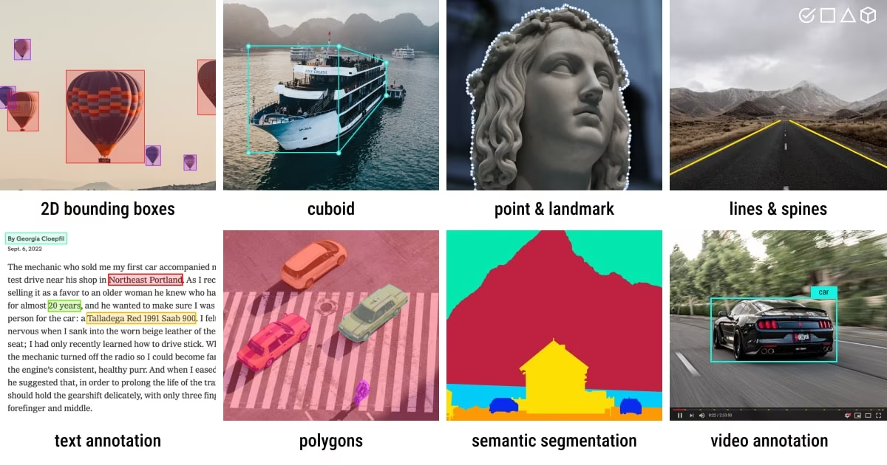
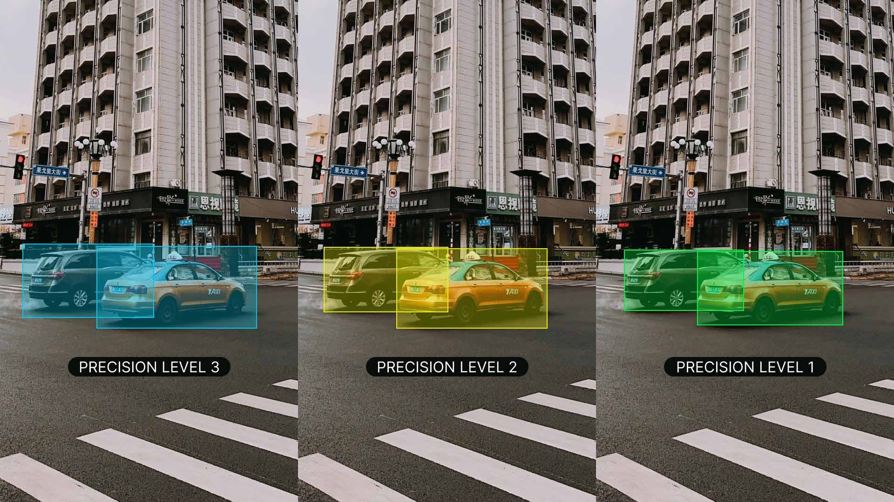

# Data Collection and Annotation Strategies for Computer Vision
Di materi ini pembahasannya mulai masuk ke tahap yang menurutku benar-benar menentukan kualitas model, yaitu proses mengumpulkan dataset dan melakukan anotasi. Aku jadi semakin paham kalau model yang bagus sebenarnya berasal dari dataset yang bagus. Bahkan sebelum training dimulai, banyak keputusan penting yang harus dibuat supaya model nantinya bisa belajar dengan benar.
## Menentukan Class Sebelum Mengumpulkan Data
Sebelum mengumpulkan gambar, hal pertama yang harus diputuskan adalah class apa saja yang ingin dikenali model. Contohnya kalau membuat sistem pendeteksi kendaraan, class bisa berupa:
- Car
- Bus
- Truck
- Motorcycle
- Bicycle

Pemilihan class ternyata harus mengikuti tujuan proyek, bukan asal memasukkan sebanyak mungkin kategori.
Materi juga menjelaskan perbedaan antara **coarse class** dan **fine class**.
**Coarse Class** menggunakan kategori yang lebih umum, misalnya:
- Vehicle
- Non Vehicle

Kelebihannya adalah proses anotasi menjadi lebih mudah dan model juga lebih sederhana.
**Fine Class** menggunakan kategori yang lebih spesifik, misalnya:
- Sedan
- SUV
- Pickup
- Truck
- Motorcycle

Proses anotasinya memang lebih lama, tetapi informasi yang diperoleh jauh lebih detail dan nantinya lebih fleksibel jika ingin mengembangkan model. Aku cukup setuju dengan saran di materi ini. Kalau memang proyek memungkinkan, lebih baik mulai dengan class yang lebih spesifik karena nanti selalu bisa digabung menjadi class yang lebih umum.
## Mengumpulkan Dataset
Dataset bisa berasal dari berbagai sumber, seperti:
- Dataset publik seperti Kaggle atau Google Dataset Search.
- Mengambil gambar sendiri menggunakan kamera.
- Menggunakan drone.
- Mengambil data internal perusahaan.
- Web scraping jika memang diperbolehkan.

Yang menarik adalah materi menyarankan menggabungkan dataset publik dengan dataset buatan sendiri supaya data menjadi lebih beragam. Semakin beragam kondisi yang dimiliki dataset, biasanya model juga akan semakin mudah melakukan generalisasi.
## Menghindari Dataset Bias
Bagian ini menurutku cukup penting. Dataset bias terjadi ketika data yang dikumpulkan tidak benar-benar mewakili kondisi dunia nyata.
Misalnya:
- Semua gambar diambil siang hari.
- Semua mobil berwarna putih.
- Semua gambar berasal dari satu kamera.
- Semua wajah berasal dari kelompok usia tertentu.

Akibatnya model memang terlihat bagus saat testing, tetapi gagal ketika digunakan pada kondisi yang berbeda.
Beberapa cara mengurangi bias yang dijelaskan di materi adalah:
- Mengambil data dari banyak sumber.
- Menyeimbangkan representasi setiap kelompok.
- Rutin mengevaluasi dataset.
- Menggunakan oversampling, augmentation, atau teknik fairness bila diperlukan.

Aku jadi semakin sadar kalau pekerjaan mengumpulkan dataset ternyata jauh lebih kompleks daripada sekadar mencari banyak gambar.
## Apa Itu Data Annotation
Data annotation adalah proses memberi label pada gambar agar model tahu apa yang harus dipelajari. Tanpa annotation, model hanya melihat kumpulan pixel tanpa mengetahui objek apa yang ada di dalam gambar tersebut. Jenis anotasi yang digunakan mengikuti task Computer Vision yang dipilih.
## Jenis-Jenis Annotation
Materi memperlihatkan cukup banyak jenis anotasi yang ternyata tidak hanya bounding box.

Beberapa jenis annotation yang umum digunakan adalah:
- Bounding Box untuk Object Detection.
- Polygon untuk Instance Segmentation.
- Mask untuk Semantic Segmentation.
- Keypoint untuk Pose Estimation.
- Cuboid untuk objek 3D.
- Landmark Point.
- Line dan Polyline.
- Text Annotation.
- Video Annotation.

Aku baru sadar ternyata dunia annotation jauh lebih luas daripada yang biasa kupakai di YOLO Detection.
## Format Annotation
Setelah menentukan jenis anotasi, kita juga harus menentukan format penyimpanannya. Beberapa format yang paling umum adalah:

| Format | Struktur File | Umumnya Digunakan Untuk |
|--------|---------------|-------------------------|
| **COCO** | Satu file JSON | Object Detection, Instance Segmentation, Keypoint Detection, Stuff & Panoptic Segmentation, Image Captioning |
| **Pascal VOC** | Satu file XML per gambar | Object Detection |
| **YOLO** | Satu file TXT per gambar | Object Detection, Segmentation, dan Pose |

Karena selama ini menggunakan Ultralytics, format YOLO tentu yang paling familiar. Yang baru kupahami adalah ternyata format YOLO berbeda tergantung task.

| Task | Isi File Label YOLO |
|------|----------------------|
| **Detection** | Class + koordinat bounding box |
| **Segmentation** | Class + koordinat bounding box + titik-titik polygon |
| **Pose** | Class + koordinat bounding box + koordinat keypoint |

Jadi meskipun sama-sama memakai format YOLO, isi file labelnya tidak selalu sama.
## Membuat Annotation Guideline
Materi menekankan bahwa annotation harus memiliki aturan yang jelas. Beberapa prinsip yang perlu diperhatikan adalah:
- Instruksi harus jelas.
- Semua annotator menggunakan aturan yang sama.
- Mengurangi bias pribadi saat memberi label.
- Menggunakan tools yang membantu mempercepat pekerjaan.

Aku jadi teringat materi sebelumnya tentang calibration. Ternyata guideline memang menjadi fondasi supaya semua annotator menghasilkan label yang konsisten.
## Annotation Tools
Materi juga membahas pentingnya memilih annotation tool yang sesuai. Tool yang baik sebaiknya:
- Mendukung semua jenis annotation yang dibutuhkan.
- Membantu menjaga konsistensi.
- Bisa langsung export ke format training.

Ultralytics Platform menjadi contoh karena sudah mendukung:
- Detection
- Segmentation
- Pose
- OBB
- Classification

Selain itu ada fitur Smart Annotation berbasis SAM yang cukup menarik karena bisa mempercepat proses labeling.
Di bagian komentar juga disebutkan beberapa alternatif open source seperti:
- CVAT
- Label Studio
- Roboflow

Jadi ternyata pilihan annotation tool sekarang sudah cukup banyak.
## Accuracy dan Precision pada Annotation
Aku sempat mengira accuracy dan precision hanya digunakan untuk mengevaluasi model, ternyata konsep ini juga berlaku pada proses annotation.
- **Accuracy** berarti label benar-benar sesuai dengan kondisi sebenarnya.
- **Precision** berarti proses memberi label dilakukan secara konsisten di seluruh dataset.

Materi memberikan ilustrasi yang cukup mudah dipahami. Kalau bounding box selalu berada di posisi yang sama tetapi semuanya bergeser dari objek, berarti precision tinggi tetapi accuracy rendah. Sebaliknya, kalau posisi bounding box sering berubah-ubah walaupun kadang benar, berarti accuracy bisa cukup baik tetapi precision 
rendah. Idealnya tentu kedua-duanya tinggi.

## Outlier pada Annotation
Outlier adalah data atau annotation yang sangat berbeda dibanding data lainnya. Contohnya:
- Salah memberi class.
- Bounding box terlalu besar.
- Bounding box terlalu kecil.
- Posisi annotation jauh dari objek.

Outlier seperti ini bisa membuat model belajar pola yang salah. Beberapa cara mendeteksinya antara lain:
- Statistik.
- Visualisasi.
- Clustering.
- Anomaly Detection.

Menurutku ini bagian yang cukup menarik karena biasanya orang langsung training tanpa pernah mengecek apakah ada annotation yang aneh.
## Quality Control Annotation
Annotation ternyata tidak boleh langsung dianggap selesai. Harus ada proses quality control, misalnya:
- Sampling hasil annotation.
- Pemeriksaan otomatis.
- Review oleh annotator lain.

Kalau ada kesalahan, bukan hanya labelnya yang diperbaiki, tetapi guideline juga ikut diperbarui supaya kesalahan yang sama tidak terus berulang. Ini menurutku masuk akal karena kualitas dataset akan sangat menentukan kualitas model.
## Strategi Agar Labeling Lebih Efisien
Di akhir materi diberikan beberapa tips supaya proses labeling tidak memakan waktu terlalu lama. Beberapa strategi yang menurutku paling berguna adalah:
- Membuat guideline yang jelas.
- Melakukan quality check secara rutin.
- Menggunakan AI pre-annotation.
- Menggunakan Active Learning agar hanya data yang paling penting yang dianotasi lebih dulu.
- Melakukan batch annotation untuk gambar yang mirip.

Aku cukup tertarik dengan Active Learning karena idenya sederhana tetapi efektif. Model lebih dulu mencari data yang paling membingungkan, lalu kita cukup memberi label pada data tersebut sehingga proses anotasi menjadi lebih hemat dibanding memberi label semua gambar secara acak.
## Catatan Pribadi

Materi ini membuatku semakin yakin kalau performa model tidak hanya ditentukan oleh arsitektur atau hyperparameter. Sebagian besar justru berasal dari kualitas dataset.

Yang paling berkesan buatku adalah pembahasan tentang bagaimana menentukan class sejak awal, menghindari dataset bias, pentingnya membuat guideline annotation, dan perbedaan accuracy serta precision pada proses anotasi. Selama ini aku lebih sering fokus ke training, padahal ternyata proses sebelum training bisa mempengaruhi hasil model jauh lebih besar.

Selain itu, sekarang aku juga mulai belajar menggunakan **CVAT** sebagai annotation tool. Saat ini CVAT sudah berhasil ku-install menggunakan **Docker** di Ubuntu dan masih tahap eksplorasi fitur-fiturnya. Sepertinya tool ini akan sering kupakai untuk proyek Computer Vision, terutama untuk proses labeling dataset.

Kalau nanti catatan belajarku tentang CVAT sudah lebih lengkap, aku berencana membuat repository khusus yang membahas instalasi, workflow, serta pengalaman menggunakannya. Untuk sekarang repositorinya masih belum tersedia.

| Repository | Status |
|------------|--------|
| 📁 CVAT Learning | Coming Soon |

Kalau diringkas, alurnya kurang lebih seperti ini:

1. Menentukan class yang tepat.
2. Mengumpulkan dataset yang beragam.
3. Melakukan annotation dengan aturan yang konsisten.
4. Melakukan quality control.
5. Baru setelah semuanya siap, dataset layak digunakan untuk training.