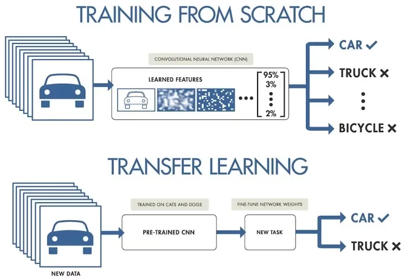
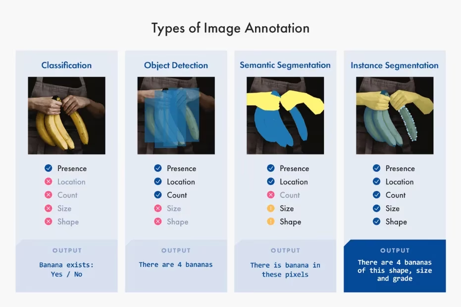
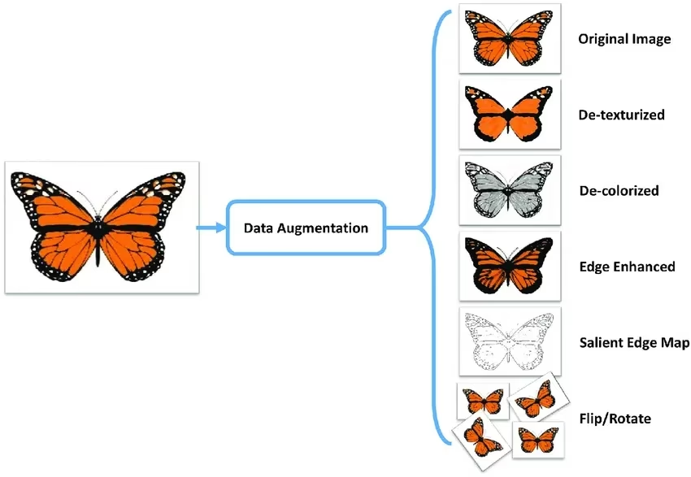
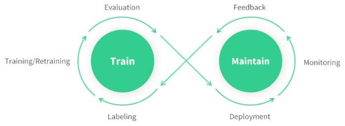

# Understanding the Key Steps in a Computer Vision Project

Materi ini lebih ke gambaran besar tentang bagaimana sebuah proyek Computer Vision berjalan dari awal sampai benar-benar dipakai di dunia nyata. Selama ini aku sering fokus ke bagian training model, padahal ternyata training cuma satu bagian dari keseluruhan proses. Justru banyak pekerjaan penting dilakukan sebelum training dimulai dan setelah model selesai dibuat.

## Gambaran Umum Alur Proyek

Secara umum, alur proyek Computer Vision kurang lebih seperti ini:

1. Menentukan tujuan proyek.
2. Mengumpulkan dan memberi label dataset.
3. Membagi dataset dan melakukan data augmentation.
4. Training model.
5. Evaluasi dan fine tuning.
6. Testing.
7. Deployment.
8. Monitoring dan maintenance.

Yang aku tangkap, setiap tahap saling berkaitan. Kalau dari awal tujuan proyek atau dataset sudah kurang tepat, kemungkinan besar hasil training juga tidak akan maksimal.

## Step 1 - Menentukan Tujuan Proyek

Hal pertama yang harus dilakukan ternyata bukan mencari dataset atau memilih model, tetapi memahami dulu masalah yang ingin diselesaikan.

Dari tujuan tersebut nantinya akan ditentukan:

- Computer Vision task yang digunakan.
- Daftar class yang dibutuhkan.
- Model yang cocok.
- Target performa yang ingin dicapai.

Materi memberikan beberapa contoh yang cukup mudah dipahami.

Kalau ingin menghitung kendaraan di jalan, Object Detection sudah cukup karena hanya perlu mengetahui lokasi kendaraan.

Kalau ingin mengetahui bentuk tumor secara detail, Image Segmentation jauh lebih cocok karena membutuhkan informasi setiap piksel.

Kalau hanya ingin mengetahui jenis dokumen, Image Classification sudah mencukupi.

Di bagian ini aku jadi semakin yakin kalau memilih task yang benar jauh lebih penting daripada buru-buru memilih model.

### Memilih Model dan Metode Training

Setelah tujuan proyek jelas, baru mulai menentukan model dan cara melatihnya.

Ada dua pendekatan utama.

**Training From Scratch**

Model benar-benar belajar dari nol. Karena belum memiliki pengetahuan apa pun, dataset yang dibutuhkan harus besar, beragam, dan berkualitas.

**Transfer Learning**

Menggunakan model yang sudah pretrained lalu melakukan fine tuning pada dataset kita sendiri. Cara ini jauh lebih hemat data dan memang menjadi pendekatan yang paling sering digunakan pada proyek YOLO.

Hal yang cukup menarik adalah ternyata pemilihan model juga mempengaruhi cara menyiapkan dataset. Misalnya ukuran gambar, format anotasi, preprocessing, bahkan format dataset bisa berbeda tergantung model yang dipakai.

Selain itu deployment juga sebaiknya dipikirkan dari awal. Kalau targetnya Raspberry Pi atau Jetson misalnya, model ringan akan jauh lebih masuk akal dibanding model yang sangat besar.

## Step 2 - Data Collection dan Annotation

Setelah tujuan proyek jelas, baru mulai mengumpulkan dataset.

Sumber dataset bisa dari:

- Mengambil foto sendiri.
- Dataset publik.
- Internet.

Kalau membuat dataset sendiri, maka gambar harus diberi anotasi.

Jenis anotasi mengikuti task yang dipilih.

- Image Classification memberi satu label untuk satu gambar.
- Object Detection menggunakan bounding box.
- Image Segmentation menggunakan polygon atau mask.
- Pose Estimation menggunakan keypoint.
- OBB menggunakan rotated bounding box.

Materi juga memperkenalkan bahwa proses anotasi sekarang bisa jauh lebih cepat dengan bantuan tools seperti Ultralytics Platform yang sudah mendukung Smart Annotation menggunakan SAM.

## Step 3 - Data Augmentation dan Dataset Split

Sebelum augmentation dilakukan, dataset harus dibagi terlebih dahulu menjadi:

- Training sekitar 70 sampai 80 persen.
- Validation sekitar 10 sampai 15 persen.
- Test sekitar 10 sampai 15 persen.

Ini ternyata penting supaya validation dan test tetap menggunakan data asli sehingga hasil evaluasi benar-benar mencerminkan kemampuan model pada data yang belum pernah dilihat.

Setelah proses split selesai, baru dilakukan data augmentation.

Contohnya:
- Flip.
- Rotate.
- Scaling.
- Transformasi lainnya.

Tujuan augmentation bukan sekadar memperbanyak jumlah gambar, tetapi membuat model lebih tahan terhadap berbagai kondisi di dunia nyata.

Aku juga suka bagian yang membahas pentingnya visualisasi dataset. Dengan melihat distribusi data, kita bisa lebih cepat menemukan class yang tidak seimbang atau masalah lain sebelum training dimulai.

## Step 4 - Model Training

Kalau dataset sudah siap, baru masuk ke tahap training.

Secara umum prosesnya meliputi:

- Menyiapkan environment.
- Install framework seperti PyTorch atau Ultralytics.
- Mengaktifkan GPU bila ada.
- Melakukan preprocessing.
- Menentukan hyperparameter.
- Menjalankan training.

YOLO sendiri sudah menyederhanakan banyak proses sehingga training bisa dilakukan dengan kode yang relatif sedikit.

Di bagian ini juga disebutkan pentingnya version control untuk dataset menggunakan DVC. Selama ini aku lebih sering memakai Git untuk source code, ternyata dataset juga sebaiknya memiliki sistem versioning supaya perubahan tetap bisa dilacak.

## Step 5 - Model Evaluation dan Fine Tuning

Setelah model selesai dilatih, performanya harus dievaluasi.

Beberapa metrik yang digunakan antara lain:

- Accuracy.
- Precision.
- Recall.
- F1 Score.

Kalau hasilnya belum sesuai target, maka dilakukan fine tuning.

Fine tuning bisa berupa:
- Mengubah learning rate.
- Mengubah batch size.
- Menyesuaikan hyperparameter lainnya.
- Sedikit mengubah konfigurasi training.

Bagian ini sebenarnya cukup familiar karena sudah pernah dipelajari di course sebelumnya.

## Step 6 - Model Testing

Awalnya aku mengira evaluation dan testing itu sama, ternyata beda.

Evaluation dilakukan selama proses pengembangan model.

Testing dilakukan ketika model sudah dianggap final dan menggunakan test set yang benar-benar belum pernah dipakai selama training maupun validation.

Di tahap ini juga dicek apakah masih ada masalah seperti:

- Overfitting.
- Underfitting.
- Data leakage.

Kalau semuanya sudah aman, model baru siap masuk ke tahap deployment.

## Step 7 - Model Deployment

Setelah model lolos testing, berikutnya adalah deployment.

Beberapa hal yang perlu dipersiapkan antara lain:

- Menentukan target deployment.
- Export model ke format seperti ONNX, TensorRT, atau CoreML.
- Menghubungkan model ke aplikasi.
- Menyiapkan infrastruktur agar mampu menangani banyak request.

Di sini mulai terlihat kalau membangun sistem Computer Vision bukan cuma soal AI, tetapi juga cukup banyak bersinggungan dengan software engineering.

## Step 8 - Monitoring, Maintenance, dan Documentation

Ini bagian yang menurutku sering terlupakan.

Model yang sudah berhasil di-deploy belum tentu akan terus bekerja dengan performa yang sama.

Seiring waktu data di dunia nyata bisa berubah sehingga akurasi model ikut menurun. Kondisi ini disebut **Model Drift**.

Karena itu model perlu terus:

- Dimonitor.
- Dievaluasi.
- Diperbarui datasetnya.
- Retraining bila diperlukan.

Selain itu dokumentasi juga tidak kalah penting.

Semua proses sebaiknya dicatat, mulai dari dataset, arsitektur model, hyperparameter, preprocessing, sampai perubahan yang dilakukan selama pengembangan.

Dengan dokumentasi yang rapi, proses pengembangan maupun troubleshooting di masa depan akan jauh lebih mudah.

## Community

Materi ini juga mengingatkan kalau kita tidak harus belajar sendirian.

Kalau mengalami kendala, ada beberapa tempat yang bisa dimanfaatkan, seperti:

- GitHub Issues.
- Discord Ultralytics.
- Dokumentasi resmi Ultralytics.

Menurutku ini cukup berguna nanti ketika mulai mengerjakan proyek yang lebih kompleks dan menemukan masalah yang belum pernah ditemui sebelumnya.

## Catatan Pribadi

Walaupun materi ini tidak terlalu teknis, menurutku tetap penting karena memberikan gambaran utuh bagaimana sebuah proyek Computer Vision dibangun.

Selama ini aku sering fokus ke training model, padahal training hanya salah satu tahap. Sebelum training ada proses perencanaan, pengumpulan data, dan anotasi yang sangat menentukan hasil akhir. Setelah training pun pekerjaan belum selesai karena masih ada testing, deployment, monitoring, dan retraining.

Kalau disimpulkan, membangun proyek Computer Vision ternyata lebih mirip membangun sebuah produk daripada sekadar menjalankan model di GPU.